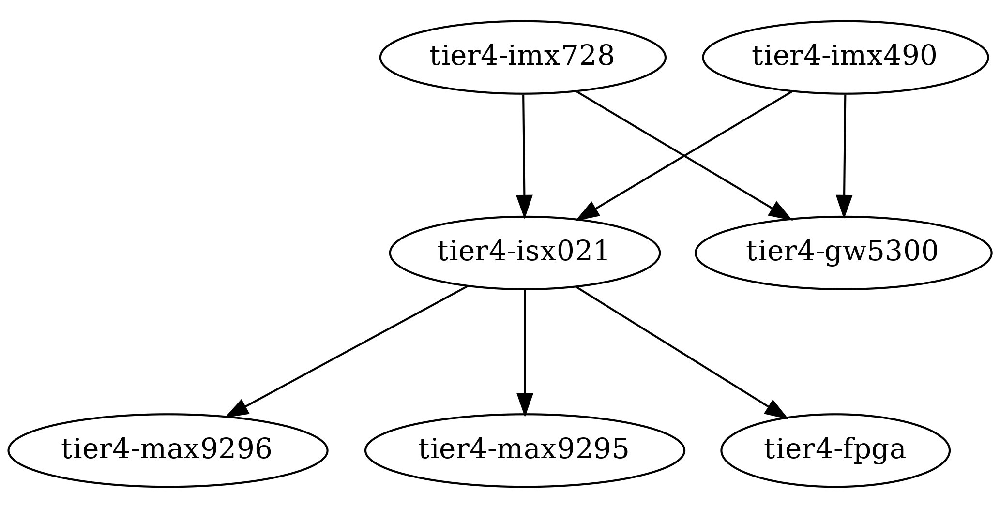

# TIER IV Automotive HDR Camera Device Driver

This repository contains the device driver for the [TIER IV Automotive HDR Camera C1, C2, and C3](https://edge.auto/automotive-camera). 

The current implementation supports only Jetson platforms. 

## Installation

You can install the driver by installing the deb package which you can download from the [release page](https://github.com/tier4/tier4_automotive_hdr_camera/releases).

The deb package installs the DKMS source tree for the driver and build it with DKMS.
It will also generate the appropriate devicetree overlays if it supports the board you are using.

You can also follow the installation instructions provided in the [quickstart guide](https://tier4.github.io/edge-auto-docs/getting_started/index.html).

## How to create a deb package from source

### Preparation

```
$ sudo apt update
$ sudo apt install make build-essential debhelper debmake devscripts dkms 
```

### Create a debian-dkms package

```
$ cd pkg/
$ ./create_deb_pkg.sh
```

You can confirm the package file with the following command.

```
$ ls ../*deb
```

## Building the camera device driver

Although the driver deb package makes use of DKMS to build and install the camera device driver you can also build it with the simple Makefile.

```
$ cd src/tier4-camera-gmsl/
$ make -f Makefile.dkms
```

Now you will see a bunch of `.ko` files.

## Loading the driver

### modprobe

It automatically handles the dependency of the device driver modules.

1. Make sure you are using the appropriate devicetree overlay for 
2. `sudo modprobe $CAMERA_DRIVER`
   1. For C1, $CAMERA_DRIVER = tier4-isx021
   2. For C2, $CAMERA_DRIVER = tier4-imx490
   3. For C3, $CAMERA_DRIVER = tier4-imx728

### Loading manually

Use `insmod` to load the individual modules with the correct order of loading.

For the order of loading read the following section.

## Dependency of the device driver modules



## Supported hardware

* Jetson AGX Orin
  * NVIDIA Jetson AGX Orin devkit
    * L4T R35, R36
  * Connect Tech Anvil
    * L4T R35.4.1, R36.4
  * ADLINK ROSCube RQX-59G
    * L4T R35
  * Vecow EAC-5000
    * L4T R35.3
* Jetson AGX Xavier
  * NVIDIA Jetson AGX Xavier devkit
    * L4T R35
  * ADLINK ROSCube RQX-58G
    * L4T R32.6.1, R35.4.1

### Note for Vecow EAC-5000 / Connect Tech Anvil users:

We provide a pre-build kernel module (.ko files) for these ECUs. Please download the pre-build binary from [release page](https://github.com/tier4/tier4_automotive_hdr_camera/releases) and follow the instructions.

### Note for ADLINK ROSCube-X RQX-58G / RQX 59G / Nvidia Jetson AGX Orin / Xavier users:

You can download the deb package and build kernel module on the target ECU.

The device type (i.e., C1 or C2) assignment is fixed at every GMSL2 port.
The following table shows the default assignment:

| overlay command                                              | GMSL2 port No. | 1    | 2    | 3    | 4    | 5    | 6    | 7    | 8    |
| ------------------------------------------------------------ | -------------- | ---- | ---- | ---- | ---- | ---- | ---- | ---- | ---- |
| `TIERIV(Tier4) ISX021 GMSL2 Camera Device Tree Overlay`      |                | C1   | C1   | C1   | C1   | C1   | C1   | C1   | C1   |
| `TIERIV(Tier4) IMX490 GMSL2 Camera Device Tree Overlay`      |                | C2   | C2   | C2   | C2   | C2   | C2   | C2   | C2   |
| `TIERIV(Tier4) IMX728 GMSL2 Camera Device Tree Overlay`      |                | C3   | C3   | C3   | C3   | C3   | C3   | C3   | C3   |
| `TIERIV(Tier4) ISX021 IMX490 GMSL2 Camera Device Tree Overlay` |                | C1   | C1   | C2   | C2   | C1   | C1   | C2   | C2   |
| `TIERIV(Tier4) ISX021 IMX490 IMX728 GMSL2 Camera Device Tree Overlay` |                | C1   | C1   | C2   | C2   | C3   | C3   | C3   | C3   |

e.g., If user executes `$ sudo /opt/nvidia/jetson-io/config-by-hardware.py -n 2="TIERIV ISX021 GMSL2 Camera Device Tree Overlay"`
on the driver installation process, all ports are assigned for C1 cameras.

## Porting the TIER IV automotive camera driver to your board

The camera driver itself will work out of the box if you have done the following items.

* Create the camera devicetree overlay for your board
* Use the appropriate values for properties of the VI node in devicetree overlay

## Contribution

We welcome contributions to the Automotive HDR Camera Device Driver. 
If you have a bug fix or new feature that you would like to contribute, please submit an issue or a pull request.

